# quastels-analysis Design System

You are building UI for **quastels-analysis**. Dark-themed, neutral palette, sans-serif typography (Satoshi), compact density on a 4px grid.

## Visual Reference

**IMPORTANT**: Study ALL screenshots below before writing any UI. Match colors, typography, spacing, layout, and motion exactly as shown.

### Homepage

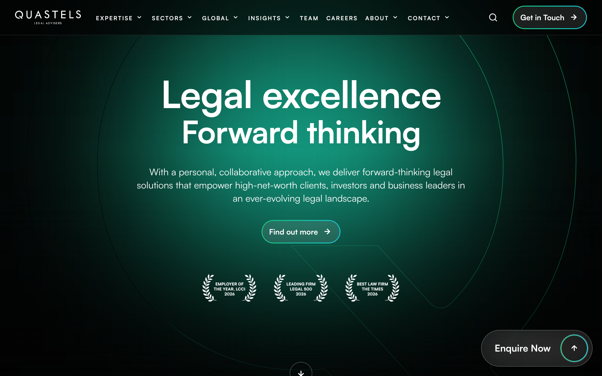

### Scroll Journey (Cinematic Visual States)

> These screenshots capture the website at different scroll depths. The design changes dramatically as you scroll — each frame shows a different cinematic state. Replicate these exact visual transitions.

#### 0% — Hero / Above the fold

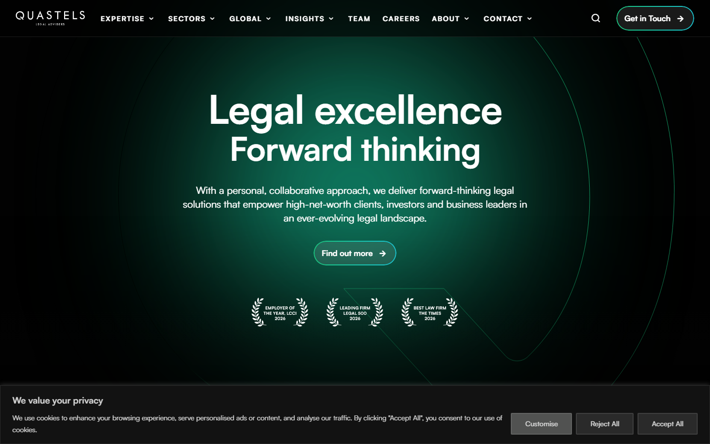

#### 17% — Mid-page at 17% scroll

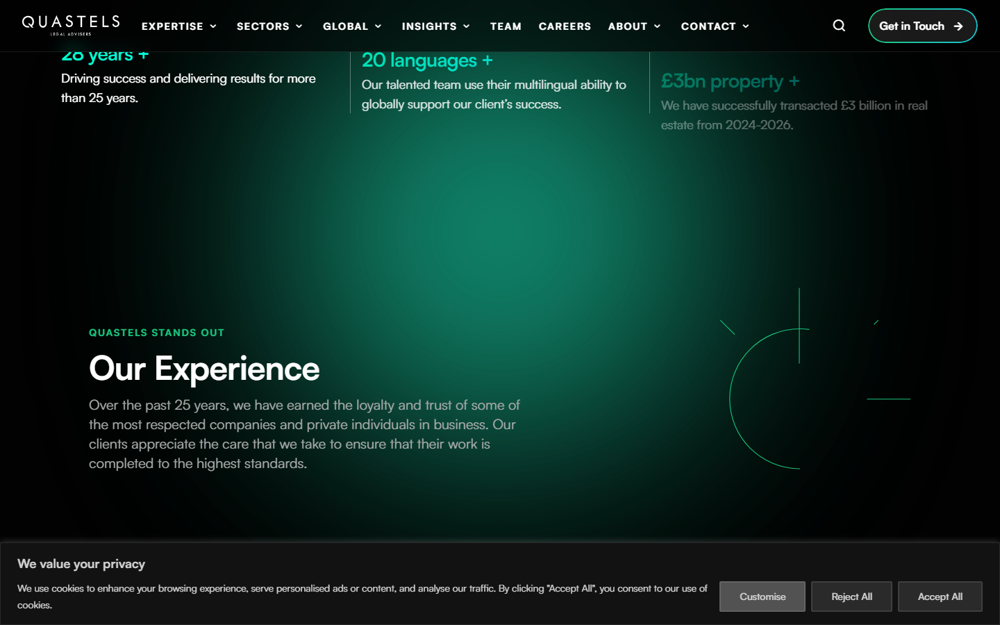

#### 33% — Mid-page at 33% scroll


#### 50% — Mid-page at 50% scroll

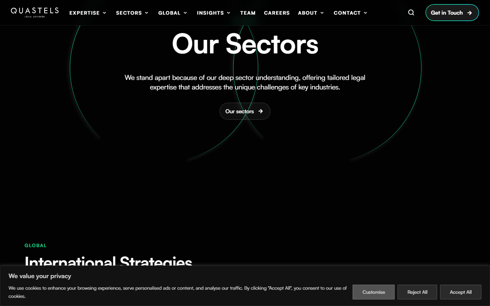

#### 67% — Mid-page at 67% scroll

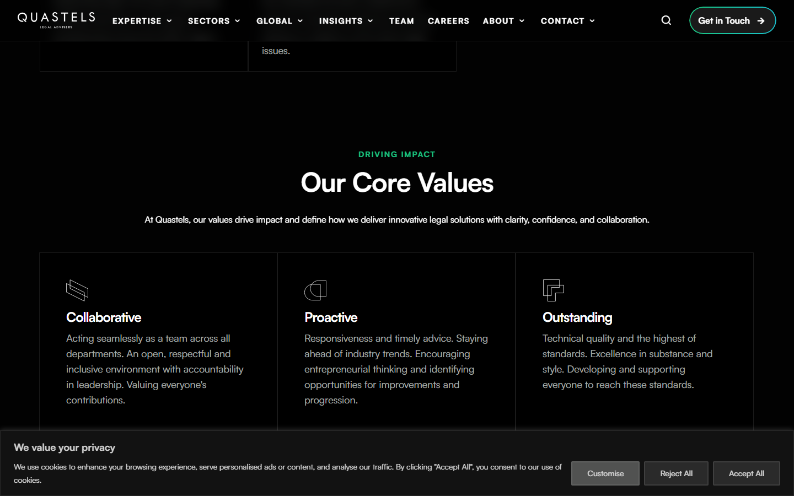

#### 83% — Mid-page at 83% scroll

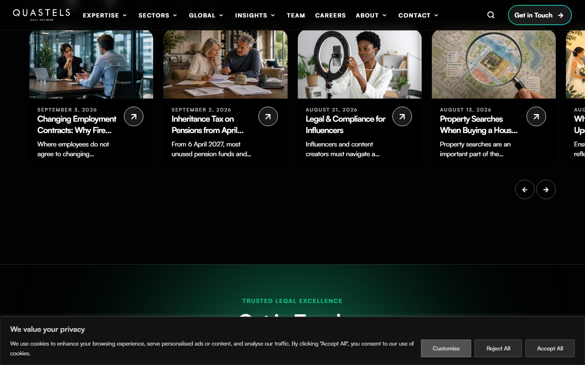

#### 100% — Footer / End of page

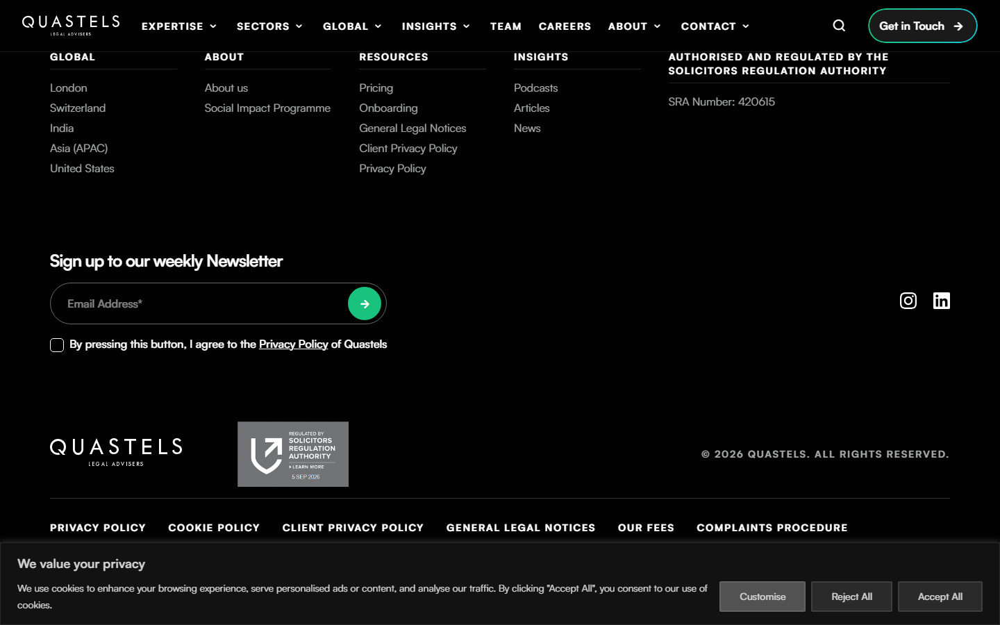

> Read `references/DESIGN.md` for full token details. Read `references/ANIMATIONS.md` for motion specs. Read `references/LAYOUT.md` for layout structure. Read `references/COMPONENTS.md` for component patterns.

## Ultra Reference Files

This package includes extended documentation. **Read these files before implementing:**

| File | Contents |
|------|----------|
| `references/DESIGN.md` | Full design system tokens, colors, typography, spacing |
| `references/VISUAL_GUIDE.md` | **START HERE** — Master visual guide with all screenshots embedded |
| `references/ANIMATIONS.md` | CSS keyframes, scroll triggers, motion library stack, video specs |
| `references/LAYOUT.md` | Flex/grid containers, page structure, spacing relationships |
| `references/COMPONENTS.md` | DOM component patterns, HTML structure, class fingerprints |
| `references/INTERACTIONS.md` | Hover/focus states with before/after style diffs |
| `screens/scroll/` | 7 scroll journey screenshots showing cinematic states |

### Animation Stack Detected

- **Web Animations API (7 active)** — animation

## Design Philosophy

- **Layered depth** — use shadow tokens to create a sense of physical layering. Each elevation level has a specific shadow.
- **Solid colors only** — no gradients anywhere. Every surface is a single flat color.
- **Single typeface** — Satoshi carries all text. Hierarchy comes from size, weight, and color — never font mixing.
- **compact density** — 4px base grid. Every dimension is a multiple of 4.
- **neutral palette** — the color temperature runs neutral, matching the sans-serif typography.
- **Minimal motion** — prefer instant state changes. Only use transitions for loading and page transitions.

## Color System

### Core Palette

| Role | Token | Hex | Use |
|------|-------|-----|-----|
| Background | `--background` | `#020202` | Page/app background |
| Text Primary | `--text-primary` | `#ffffff` | Headings, body text |
| Text Muted | `--text-muted` | `#a3a8a6` | Captions, placeholders |
| Border | `--border` | `#515251` | Dividers, card borders |

### Status Colors

| Status | Hex | Use |
|--------|-----|-----|
| Success | `#19c37d` | Confirmations, positive trends |
| Danger | `#c02b0a` | Errors, destructive actions |

### Extended Palette

- `#e5e7eb` — Light surface or highlight color
- `#d0d0d0`
- `#293c5b`
- `#008000`

### CSS Variable Tokens

```css
--wp-editor-canvas-background: #ddd;
--wp-admin-border-width-focus: 2px;
```

## Typography

### Font Stack

- **Satoshi** — Heading 1, Heading 2, Heading 3, Body, Caption

### Type Scale

| Role | Family | Size | Weight |
|------|--------|------|--------|
| Heading 1 | Satoshi | 48px / 3rem | 700 |
| Heading 2 | Satoshi | 32px / 2rem | 600 |
| Heading 3 | Satoshi | 24px / 1.5rem | 600 |
| Body | Satoshi | 16px / 1rem | 400 |
| Caption | Satoshi | 12px / 0.75rem | 400 |

### Typography Rules

- All text uses **Satoshi** — never add another font family
- Max 3-4 font sizes per screen
- Headings: weight 600-700, body: weight 400
- Use color and opacity for text hierarchy, not additional font sizes
- Line height: 1.5 for body, 1.2 for headings

## Spacing & Layout

### Base Grid: 4px

Every dimension (margin, padding, gap, width, height) must be a multiple of **4px**.

### Spacing Scale

`2, 4, 8, 10, 12, 14, 16, 20, 24, 28, 32, 40` px

### Spacing as Meaning

| Spacing | Use |
|---------|-----|
| 4-8px | Tight: related items (icon + label, avatar + name) |
| 12-16px | Medium: between groups within a section |
| 24-32px | Wide: between distinct sections |
| 48px+ | Vast: major page section breaks |

### Border Radius

Scale: `2px, 12px, 24px, 100px`
Default: `24px`

## Component Patterns

### Card

```css
.card {
  background: #020202;
  border: 1px solid #515251;
  border-radius: 24px;
  padding: 16px;
  box-shadow: rgba(0, 0, 0, 0) 0px 0px 0px 0px, rgba(0, 0, 0, 0) 0px 0px 0px 0px, rgba(0, 0, 0, 0.1) 0px 10px 15px -3px, rgba(0, 0, 0, 0.1) 0px 4px 6px -4px;
}
```

```html
<div class="card">
  <h3>Card Title</h3>
  <p>Card content goes here.</p>
</div>
```

### Button

```css
/* Primary */
.btn-primary {
  background: #444444;
  color: #ffffff;
  border-radius: 24px;
  padding: 8px 16px;
  font-weight: 500;
  transition: opacity 150ms ease;
}
.btn-primary:hover { opacity: 0.9; }

/* Ghost */
.btn-ghost {
  background: transparent;
  border: 1px solid #515251;
  color: #ffffff;
  border-radius: 24px;
  padding: 8px 16px;
}
```

```html
<button class="btn-primary">Get Started</button>
<button class="btn-ghost">Learn More</button>
```

### Input

```css
.input {
  background: #020202;
  border: 1px solid #515251;
  border-radius: 24px;
  padding: 8px 12px;
  color: #ffffff;
  font-size: 14px;
}
.input:focus { border-color: var(--accent); outline: none; }
```

```html
<input class="input" type="text" placeholder="Search..." />
```

### Badge / Chip

```css
.badge {
  display: inline-flex;
  align-items: center;
  padding: 4px 8px;
  border-radius: 9999px;
  font-size: 12px;
  font-weight: 500;
  background: #020202;
  color: #a3a8a6;
}
```

```html
<span class="badge">New</span>
<span class="badge">Beta</span>
```

### Modal / Dialog

```css
.modal-backdrop { background: rgba(0, 0, 0, 0.6); }
.modal {
  background: #020202;
  border: 1px solid #515251;
  border-radius: 100px;
  padding: 24px;
  max-width: 480px;
  width: 90vw;
  box-shadow: rgba(0, 0, 0, 0) 0px 0px 0px 0px, rgba(0, 0, 0, 0) 0px 0px 0px 0px, rgba(0, 0, 0, 0.1) 0px 10px 15px -3px, rgba(0, 0, 0, 0.1) 0px 4px 6px -4px;
}
```

```html
<div class="modal-backdrop">
  <div class="modal">
    <h2>Dialog Title</h2>
    <p>Dialog content.</p>
    <button class="btn-primary">Confirm</button>
    <button class="btn-ghost">Cancel</button>
  </div>
</div>
```

### Table

```css
.table { width: 100%; border-collapse: collapse; }
.table th {
  text-align: left;
  padding: 8px 12px;
  font-weight: 500;
  font-size: 12px;
  color: #a3a8a6;
  text-transform: uppercase;
  letter-spacing: 0.05em;
  border-bottom: 1px solid #515251;
}
.table td {
  padding: 12px;
  border-bottom: 1px solid #515251;
}
```

```html
<table class="table">
  <thead><tr><th>Name</th><th>Status</th><th>Date</th></tr></thead>
  <tbody>
    <tr><td>Item One</td><td>Active</td><td>Jan 1</td></tr>
    <tr><td>Item Two</td><td>Pending</td><td>Jan 2</td></tr>
  </tbody>
</table>
```

### Navigation

```css
.nav {
  display: flex;
  align-items: center;
  gap: 8px;
  padding: 12px 16px;
  border-bottom: 1px solid #515251;
}
.nav-link {
  color: #a3a8a6;
  padding: 8px 12px;
  border-radius: 24px;
  transition: color 150ms;
}
.nav-link:hover { color: #ffffff; }
```

```html
<nav class="nav">
  <a href="/" class="nav-link active">Home</a>
  <a href="/about" class="nav-link">About</a>
  <a href="/pricing" class="nav-link">Pricing</a>
  <button class="btn-primary" style="margin-left: auto">Get Started</button>
</nav>
```

## Animation & Motion

This project uses **subtle motion**. Transitions smooth state changes without calling attention.

### Motion Guidelines

- **Duration:** 150-300ms for micro-interactions, 300-500ms for page transitions
- **Easing:** `ease-out` for enters, `ease-in` for exits
- **Direction:** Elements enter from bottom/right, exit to top/left
- **Reduced motion:** Always respect `prefers-reduced-motion` — disable animations when set

## Depth & Elevation

### Shadow Tokens

- Floating (dropdowns, popovers): `rgba(0, 0, 0, 0) 0px 0px 0px 0px, rgba(0, 0, 0, 0) 0px 0px 0px 0px, rgba(0, 0, 0, 0.1) 0px 10px 15px -3px, rgba(0, 0, 0, 0.1) 0px 4px 6px -4px`

## Anti-Patterns (Never Do)

- **No gradients** — solid colors only, everywhere
- **No blur effects** — no backdrop-blur, no filter: blur()
- **No zebra striping** — tables and lists use borders for separation
- **No invented colors** — every hex value must come from the palette above
- **No arbitrary spacing** — every dimension is a multiple of 4px
- **No extra fonts** — only Satoshi are allowed
- **No arbitrary border-radius** — use the scale: 2px, 12px, 24px, 100px
- **No opacity for disabled states** — use muted colors instead

## Workflow

1. **Read** `references/DESIGN.md` before writing any UI code
2. **Pick colors** from the Color System section — never invent new ones
3. **Set typography** — Satoshi only, using the type scale
4. **Build layout** on the 4px grid — check every margin, padding, gap
5. **Match components** to patterns above before creating new ones
6. **Apply elevation** — use shadow tokens
7. **Validate** — every value traces back to a design token. No magic numbers.

## Brand Spec

- **Site URL:** `https://www.quastels.com/`
- **Brand typeface:** Satoshi

## Quick Reference

```
Background:     #020202
Surface:        (not extracted)
Text:           #ffffff / #a3a8a6
Accent:         (not extracted)
Border:         #515251
Font:           Satoshi
Spacing:        4px grid
Radius:         24px
Components:     0 detected
```

## When to Trigger

Activate this skill when:
- Creating new components, pages, or visual elements for quastels-analysis
- Writing CSS, Tailwind classes, styled-components, or inline styles
- Building page layouts, templates, or responsive designs
- Reviewing UI code for design consistency
- The user mentions "quastels-analysis" design, style, UI, or theme
- Generating mockups, wireframes, or visual prototypes

---

# Full Reference Files

> Every output file is embedded below. Claude has full design system context from /skills alone.

## Design System Tokens (DESIGN.md)

# quastels-analysis DESIGN.md

> Auto-generated design system — reverse-engineered via static analysis by skillui.
> Frameworks: None detected
> Colors: 10 · Fonts: 1 · Components: 0
> Icon library: not detected · State: not detected
> Primary theme: dark · Dark mode toggle: no · Motion: none

## Visual Reference

**Match this design exactly** — study colors, fonts, spacing, and component shapes before writing any UI code.


---

## 1. Visual Theme & Atmosphere

This is a **dark-themed** interface with a neutral tone. Depth is expressed through layered shadows and subtle surface color variation. Typography uses **Satoshi** throughout — a clean, modern choice that maintains consistency. Spacing follows a **4px base grid** (compact density), with scale: 2, 4, 8, 10, 12, 14, 16, 20px.

---

## 2. Color Palette & Roles

| Token | Hex | Role | Use |
|---|---|---|---|
| background | `#020202` | background | Page background, darkest surface |
| text-primary | `#ffffff` | text-primary | Headings and body text |
| text-muted | `#a3a8a6` | text-muted | Captions, placeholders, secondary info |
| border | `#515251` | border | Dividers, card borders, outlines |
| danger | `#c02b0a` | danger | Error states, destructive actions |
| success | `#19c37d` | success | Success states, positive indicators |
| info | `#293c5b` | info | Informational highlights |
| unknown | `#e5e7eb` | unknown | Palette color |
| unknown | `#d0d0d0` | unknown | Palette color |
| unknown | `#008000` | unknown | Palette color |

### CSS Variable Tokens

```css
--wp-editor-canvas-background: #ddd;
--wp-admin-border-width-focus: 2px;
```


---

## 3. Typography Rules

**Font Stack:**
- **Satoshi** — Heading 1, Heading 2, Heading 3, Body, Caption

| Role | Font | Size | Weight |
|---|---|---|---|
| Heading 1 | Satoshi | 48px / 3rem | 700 |
| Heading 2 | Satoshi | 32px / 2rem | 600 |
| Heading 3 | Satoshi | 24px / 1.5rem | 600 |
| Body | Satoshi | 16px / 1rem | 400 |
| Caption | Satoshi | 12px / 0.75rem | 400 |

**Typographic Rules:**
- Use **Satoshi** for all text — do not mix font families
- Maintain consistent hierarchy: no more than 3-4 font sizes per screen
- Headings use bold (600-700), body uses regular (400)
- Line height: 1.5 for body text, 1.2 for headings
- Use color and opacity for secondary hierarchy, not additional font sizes


---

## 4. Component Stylings

No components detected. Scan `src/components/` or `components/` to populate this section.

---

## 5. Layout Principles

- **Base spacing unit:** 4px
- **Spacing scale:** 2, 4, 8, 10, 12, 14, 16, 20, 24, 28, 32, 40
- **Border radius:** 2px, 12px, 24px, 100px

**Spacing as Meaning:**
| Spacing | Use |
|---|---|
| 4-8px | Tight: related items within a group |
| 12-16px | Medium: between groups |
| 24-32px | Wide: between sections |
| 48px+ | Vast: major section breaks |


---

## 6. Depth & Elevation

### Floating — dropdowns, popovers, modals

- `rgba(0, 0, 0, 0) 0px 0px 0px 0px, rgba(0, 0, 0, 0) 0px 0px 0px 0px, rgba(0, 0, 0, 0.1) 0px 10px 15px -3px, rgba(0, 0, 0, 0.1) 0px 4px 6px -4px`


---

## 8. Do's and Don'ts

### Do's

- Use `#020202` as the primary page background
- Use **Satoshi** for all UI text
- Follow the **4px** spacing grid for all margins, padding, and gaps
- Use the defined shadow tokens for elevation — see Section 6
- Use border-radius from the scale: 2px, 12px, 24px, 100px

### Don'ts

- Don't introduce colors outside this palette — extend the design tokens first
- Don't mix font families — use Satoshi consistently
- Don't use arbitrary spacing values — stick to multiples of 4px
- Don't create custom box-shadow values outside the system tokens
- Don't use gradients — the design uses solid colors only
- Don't use arbitrary border-radius values — pick from the defined scale
- Don't use backdrop-blur or blur effects

### Anti-Patterns (detected from codebase)

- No gradient backgrounds
- No blur or backdrop-blur effects
- No zebra striping on tables/lists


---

## 9. Responsive Behavior

No breakpoints detected. Consider adding responsive breakpoints to the design system.

---

## 10. Agent Prompt Guide

Use these as starting points when building new UI:

### Build a Card

```
Background: #020202
Border: 1px solid #515251
Radius: 24px
Padding: 16px
Font: Satoshi
Use shadow tokens from Section 6.
```

### Build a Button

```
Primary: bg var(--accent), text white
Ghost: bg transparent, border #515251
Padding: 8px 16px
Radius: 24px
Hover: opacity 0.9 or lighter shade
Focus: ring with var(--accent)
```

### Build a Page Layout

```
Background: #020202
Max-width: 1280px, centered
Grid: 4px base
Responsive: mobile-first, breakpoints from Section 9
```

### Build a Stats Card

```
Surface: #020202
Label: #a3a8a6 (muted, 12px, uppercase)
Value: #ffffff (primary, 24-32px, bold)
Status: use success/warning/danger from Section 2
```

### Build a Form

```
Input bg: #020202
Input border: 1px solid #515251
Focus: border-color var(--accent)
Label: #a3a8a6 12px
Spacing: 16px between fields
Radius: 24px
```

### General Component

```
1. Read DESIGN.md Sections 2-6 for tokens
2. Colors: only from palette
3. Font: Satoshi, type scale from Section 3
4. Spacing: 4px grid
5. Components: match patterns from Section 4
6. Elevation: shadow tokens
```

## Visual Guide — Screenshots (VISUAL_GUIDE.md)

# quastels-analysis — Visual Guide

> Master visual reference. Study every screenshot carefully before implementing any UI.
> Match colors, layout, typography, spacing, and motion states exactly.

**Motion Stack:** **Web Animations API (7 active)**

## Scroll Journey

The page has cinematic scroll animations. Each screenshot below shows the exact visual state at that scroll depth.
**Replicate these transitions precisely** — the design changes dramatically as you scroll.

### Hero — Above the fold

*Scroll position: 0px of 9372px total*


### 17% scroll depth

*Scroll position: 1440px of 9372px total*


### 33% scroll depth

*Scroll position: 2796px of 9372px total*


### 50% scroll depth

*Scroll position: 4236px of 9372px total*


### 67% scroll depth

*Scroll position: 5676px of 9372px total*


### 83% scroll depth

*Scroll position: 7032px of 9372px total*


### Footer — End of page

*Scroll position: 8472px of 9372px total*


## Full Page Screenshots

### Quastels | London Law Firm | Premier Law Firms in Central London

*URL: `https://www.quastels.com/`*


### Expertise | Quastels

*URL: `https://www.quastels.com/expertise/`*


### Corporate Finance Lawyers London | Banking & Finance

*URL: `https://www.quastels.com/our-expertise/finance-banking/`*


### Commercial Real Estate Law Firm London | Quastels

*URL: `https://www.quastels.com/our-expertise/commercial-real-estate/`*


### Construction Solicitors | Law Firm | Quastels

*URL: `https://www.quastels.com/our-expertise/construction/`*


## Section Screenshots

Clipped sections showing individual components in context.

### Section 1 — `section`

*1440×982px*


### Section 1 — `section`

*1440×630px*


### Section 2 — `section`

*1440×1200px*


### Section 1 — `section`

*1440×651px*


### Section 2 — `section`

*1440×663px*


### Section 1 — `section`

*1440×606px*


### Section 2 — `section`

*1440×790px*


### Section 1 — `section`

*1440×686px*


### Section 2 — `section`

*1440×1033px*


## Animations & Motion (ANIMATIONS.md)

# Animation Reference

> Cinematic motion design extracted from live DOM. Follow these specs exactly to recreate the experience.

## Motion Technology Stack

| Library | Type | Notes |
|---------|------|-------|
| **Web Animations API (7 active)** | animation |  |

## Scroll Journey

The page is **9,372px** tall. Each frame below shows what the user sees at that scroll depth.

> **Use these screenshots to understand WHAT animates, WHEN it animates, and HOW it moves.**

### 0% — Top / Hero
Scroll position: 0px


### 17% — Opening Section
Scroll position: 1,440px


### 33% — First Feature Section
Scroll position: 2,796px


### 50% — Mid-Page
Scroll position: 4,236px


### 67% — Lower Content
Scroll position: 5,676px


### 83% — Near Footer
Scroll position: 7,032px


### 100% — Bottom / Footer
Scroll position: 8,472px


## Scroll Animation Patterns

| Pattern | Library | Element Count | Duration | Delay | Easing |
|---------|---------|---------------|----------|-------|--------|
| parallax / sticky scroll | CSS | 4 | — | — | — |

### CSS Implementation

## CSS Keyframes (20 extracted)

### `@keyframes spin`

Duration: `30s` · Easing: `ease-in-out` · Delay: `0s` · Iteration: `infinite` · Fill: `none`

Used by: `.animate-\[spin_30s_ease-in-out_infinite\]`

```css
@keyframes spin {
  100% {
    transform: rotate(1turn);
  }
}
```

> Transform/motion animation

### `@keyframes expertise_bg`

Duration: `18s` · Easing: `linear` · Delay: `0s` · Iteration: `infinite` · Fill: `none`

Used by: `.animate-expertise_bg`

```css
@keyframes expertise_bg {
  0% {
    transform: translateY(0px);
  }
  33% {
    transform: translateY(10px);
  }
  66% {
    transform: translateY(25px);
  }
  100% {
    transform: translateY(0px);
  }
}
```

> Transform/motion animation

### `@keyframes gradient_one`

Duration: `30s` · Easing: `ease-in-out` · Delay: `0s` · Iteration: `infinite` · Fill: `none`

Used by: `.animate-glow_one`

```css
@keyframes gradient_one {
  0% {
    opacity: 1;
  }
  40% {
    opacity: 1;
  }
  60% {
    opacity: 0.5;
  }
  100% {
    opacity: 1;
  }
}
```

> Opacity fade

### `@keyframes gradient_two`

Duration: `24s` · Easing: `ease-in-out` · Delay: `0s` · Iteration: `infinite` · Fill: `none`

Used by: `.animate-glow_two`

```css
@keyframes gradient_two {
  0% {
    opacity: 0;
  }
  50% {
    opacity: 1;
  }
  100% {
    opacity: 0;
  }
}
```

> Opacity fade

### `@keyframes ping`

Duration: `1s` · Easing: `cubic-bezier(0, 0, 0.2, 1)` · Delay: `0s` · Iteration: `infinite` · Fill: `none`

Used by: `.animate-ping`

```css
@keyframes ping {
  75%, 100% {
    opacity: 0;
    transform: scale(2);
  }
}
```

> Fade + motion enter animation

### `@keyframes scroll-marquee`

Duration: `20s` · Easing: `linear` · Delay: `0s` · Iteration: `infinite` · Fill: `none`

Used by: `.marquee-content`

```css
@keyframes scroll-marquee {
  0% {
    transform: translateY(0px);
  }
  100% {
    transform: translateY(-50%);
  }
}
```

> Transform/motion animation

### `@keyframes swipe`

Duration: `6s` · Easing: `cubic-bezier(0.65, 0.05, 0.36, 1)` · Delay: `0s` · Iteration: `infinite` · Fill: `none`

Used by: `.after\:animate-swipe::after`

```css
@keyframes swipe {
  0% {
    content: var(--tw-content);
    transform: translateX(-200%);
  }
  100% {
    content: var(--tw-content);
    transform: translateX(200%);
  }
}
```

> Transform/motion animation

### `@keyframes plyr-progress`

Duration: `1s` · Easing: `linear` · Delay: `0s` · Iteration: `infinite` · Fill: `none`

Used by: `.plyr--loading .plyr__progress__buffer`

```css
@keyframes plyr-progress {
  100% {
  }
}
```

> Background color/gradient shift · Background position (shimmer/scroll)

### `@keyframes plyr-popup`

Duration: `0.2s` · Easing: `ease` · Delay: `0s` · Iteration: `1` · Fill: `none`

Used by: `.plyr__menu__container`

```css
@keyframes plyr-popup {
  0% {
    opacity: 0.5;
    transform: translateY(10px);
  }
  100% {
    opacity: 1;
    transform: translateY(0px);
  }
}
```

> Fade + motion enter animation

### `@keyframes plyr-fade-in`

Duration: `0.3s` · Easing: `ease` · Delay: `0s` · Iteration: `1` · Fill: `none`

Used by: `.plyr__captions`

```css
@keyframes plyr-fade-in {
  0% {
    opacity: 0;
  }
  100% {
    opacity: 1;
  }
}
```

> Opacity fade

### `@keyframes swiper-preloader-spin`

Duration: `1s` · Easing: `linear` · Delay: `0s` · Iteration: `infinite` · Fill: `none`

Used by: `.swiper-watch-progress .swiper-slide-visible .swiper-lazy-preloader, .swiper:not`

```css
@keyframes swiper-preloader-spin {
  0% {
    transform: rotate(0deg);
  }
  100% {
    transform: rotate(1turn);
  }
}
```

> Transform/motion animation

### `@keyframes gformLoader`

Duration: `1.1s` · Easing: `linear` · Delay: `0s` · Iteration: `infinite` · Fill: `none`

Used by: `.gform_wrapper.gravity-theme .gform-loader`

```css
@keyframes gformLoader {
  0% {
    transform: rotate(0deg);
  }
  100% {
    transform: rotate(360deg);
  }
}
```

> Transform/motion animation

### `@keyframes show-content-image`

```css
@keyframes show-content-image {
  0% {
    visibility: hidden;
  }
  99% {
    visibility: hidden;
  }
  100% {
    visibility: visible;
  }
}
```

### `@keyframes turn-on-visibility`

```css
@keyframes turn-on-visibility {
  0% {
    opacity: 0;
  }
  100% {
    opacity: 1;
  }
}
```

> Opacity fade

### `@keyframes turn-off-visibility`

```css
@keyframes turn-off-visibility {
  0% {
    opacity: 1;
    visibility: visible;
  }
  99% {
    opacity: 0;
    visibility: visible;
  }
  100% {
    opacity: 0;
    visibility: hidden;
  }
}
```

> Opacity fade

### `@keyframes lightbox-zoom-in`

```css
@keyframes lightbox-zoom-in {
  0% {
    transform: translate(calc((-100vw + var(--wp--lightbox-scrollbar-width))/2 + var(--wp--lightbox-initial-left-position)),calc(-50vh + var(--wp--lightbox-initial-top-position))) scale(var(--wp--lightbox-scale));
  }
  100% {
    transform: translate(-50%, -50%) scale(1);
  }
}
```

> Transform/motion animation

### `@keyframes lightbox-zoom-out`

```css
@keyframes lightbox-zoom-out {
  0% {
    transform: translate(-50%, -50%) scale(1);
    visibility: visible;
  }
  99% {
    visibility: visible;
  }
  100% {
    transform: translate(calc((-100vw + var(--wp--lightbox-scrollbar-width))/2 + var(--wp--lightbox-initial-left-position)),calc(-50vh + var(--wp--lightbox-initial-top-position))) scale(var(--wp--lightbox-scale));
    visibility: hidden;
  }
}
```

> Transform/motion animation

### `@keyframes overlay-menu__fade-in-animation`

```css
@keyframes overlay-menu__fade-in-animation {
  0% {
    opacity: 0;
    transform: translateY(0.5em);
  }
  100% {
    opacity: 1;
    transform: translateY(0px);
  }
}
```

> Fade + motion enter animation

### `@keyframes spin-btn`

```css
@keyframes spin-btn {
  0% {
    transform: rotate(0deg);
  }
  100% {
    transform: rotate(1turn);
  }
}
```

> Transform/motion animation

### `@keyframes spin2`

```css
@keyframes spin2 {
  0% {
    transform: rotate(-90deg);
  }
  100% {
    transform: rotate(1turn);
  }
}
```

> Transform/motion animation

## Global Transition Declarations

These `transition` values were extracted from CSS rules across the site:

```css
transition: 0.2s;
transition: opacity 0.3s;
transition: opacity 0.2s;
transition: opacity 0.15s;
transition: opacity 0.12s, transform 0.12s;
transition: 0.4s cubic-bezier(0.215, 0.61, 0.355, 1);
transition: box-shadow 0.3s;
transition: transform 0.4s ease-in-out;
transition: 0.1s ease-in-out;
transition: transform 0.3s;
transition: height 0.35s cubic-bezier(0.4, 0, 0.2, 1), width 0.35s cubic-bezier(0.4, 0, 0.2, 1);
transition: 0.3s;
```

## How to Recreate This Motion Design

### Step 1 — Install Dependencies

```bash
```

### Step 2 — Scroll-Reveal Pattern

Elements that animate into view follow this pattern:

```css
/* Initial hidden state */
.reveal {
  opacity: 0;
  transform: translateY(40px);
  transition: opacity 0.2s cubic-bezier(0.4, 0, 0.2, 1),
              transform 0.2s cubic-bezier(0.4, 0, 0.2, 1);
}
.reveal.visible {
  opacity: 1;
  transform: translateY(0);
}
```

### Step 3 — Key Motion Principles

- **Duration scale:** `0.2s` · `0.3s` · `0.15s` · `0.12s` — use these values, never invent new durations
- **Always add** `@media (prefers-reduced-motion: reduce) { * { animation-duration: 0.01ms !important; transition-duration: 0.01ms !important; } }`

### Step 4 — Scroll Journey Reference

Match what happens at each scroll position:

- **0%** (`0px`) → `screens/scroll/scroll-000.png`
- **17%** (`1440px`) → `screens/scroll/scroll-017.png`
- **33%** (`2796px`) → `screens/scroll/scroll-033.png`
- **50%** (`4236px`) → `screens/scroll/scroll-050.png`
- **67%** (`5676px`) → `screens/scroll/scroll-067.png`
- **83%** (`7032px`) → `screens/scroll/scroll-083.png`
- **100%** (`8472px`) → `screens/scroll/scroll-100.png`

## Layout & Grid (LAYOUT.md)

# Layout Reference

> Auto-extracted from live DOM. Use this to understand how the site is structured spatially.

## Spacing System

**Base grid:** 4px

**Scale:** `2, 4, 8, 10, 12, 14, 16, 20, 24, 28, 32, 40, 48, 56, 60` px

| Spacing | Semantic Use |
|---------|-------------|
| 4px | Tight — within a component |
| 8px | Medium — between sibling items |
| 16px | Wide — between sections |
| 32px | Vast — major section breaks |

## Flex Layouts

| Element | Direction | Justify | Align | Gap | Children |
|---------|-----------|---------|-------|-----|----------|
| `div.px-6.xl:px-8` | row | — | center | — | 4 |
| `div.hidden.ml-auto` | row | — | center | — | 2 |
| `div.my-12.lg:my-[100px]` | row | space-between | center | — | 2 |
| `div.flex.flex-col` | row | space-between | center | — | 2 |
| `div.cky-prefrence-btn-wrapper` | row | center | center | 8px | 3 |
| `div.flex.flex-col` | row | — | center | 32px | 2 |
| `div.flex.md:items-center` | row | — | center | — | 2 |
| `div.relative.inline-flex` | row | space-between | center | 20px | 2 |

## Grid Layouts

| Element | Template Columns | Gap | Children |
|---------|-----------------|-----|----------|
| `div.grid.grid-cols-12` | `108px 108px 108px 108px 108px 108px 108px 108px 10` | 0px normal | 3 |
| `div.grid.grid-cols-12` | `108px 108px 108px 108px 108px 108px 108px 108px 10` | — | 2 |
| `div.grid.grid-cols-12` | `108px 108px 108px 108px 108px 108px 108px 108px 10` | — | 2 |
| `ul#menu-footer-menu.footer-menu.grid` | `71.3281px 71.3281px 71.3281px 71.3281px 71.3281px ` | 80px 40px | 8 |

## Structural Containers

### `<header>` (`header.header.py-2`)

```
display:          block
padding:          12px 0px
children:         2
```

### `<footer>` (`footer.footer.py-[80px]`)

```
display:          block
padding:          130px 0px
children:         1
```

### `<section>` (`section.relative.border-t-1`)

```
display:          block
children:         1
```

### `<section>` (`section#hero.pt-[165px].pb-[60px]`)

```
display:          block
padding:          180px 0px 144px
children:         1
```

### `<section>` (`section#intro.relative.z-[7]`)

```
display:          block
children:         1
```

### `<section>` (`section.my-[80px].lg:my-[180px]`)

```
display:          block
children:         1
```

### `<section>` (`section#blur-out-of-focus.relative`)

```
display:          block
children:         1
```

### `<section>` (`section.py-[90px].z-1`)

```
display:          block
padding:          120px 0px 180px
children:         1
```

### `<section>` (`section#reveal-by-scroll.text-center.py-[90px]`)

```
display:          block
padding:          180px 0px
children:         3
```

### `<section>` (`section.my-[80px].lg:my-[100px]`)

```
display:          block
children:         1
```

### `<section>` (`section.my-[80px].lg:my-[140px]`)

```
display:          block
children:         1
```

### `<section>` (`section#latest-news.overflow-hidden.mb-[80px]`)

```
display:          block
children:         1
```

## Layout Rules

- **Container max-width:** `1440px` — always center with `margin: auto`
- Primary layout system: **Flexbox**
- Secondary layout system: **CSS Grid** (used for card grids and multi-column layouts)
- Every spacing value must be a multiple of **4px**
- Never use arbitrary margin/padding values outside the spacing scale

## Component Patterns (COMPONENTS.md)

# Component Reference

> Repeated DOM patterns detected by structural analysis. Each component appeared 3+ times.

## Detected Components

| Component | Category | Instances | Key Classes |
|-----------|----------|-----------|-------------|
| **Transition** | unknown | 30× | `.transition` |
| **Mb 4** | unknown | 7× | `.mb-4`, `.subheading` |
| **Cky Accordion** | unknown | 6× | `.cky-accordion` |
| **Cky Accordion Item** | card | 6× | `.cky-accordion-item` |
| **Cky Accordion Header Wrapper** | unknown | 6× | `.cky-accordion-header-wrapper` |
| **Cky Accordion Btn** | button | 6× | `.cky-accordion-btn` |
| **Cky Accordion Header Des** | unknown | 6× | `.cky-accordion-header-des` |
| **Border B 1** | list-item | 6× | `.border-b-1`, `.border-opacity-20`, `.border-white` |
| **!Text White** | unknown | 6× | `.!text-white`, `.2xl:pb-12`, `.[@media(min-width:1360px)]:text-sm` |
| **Cky Accordion Header** | unknown | 4× | `.cky-accordion-header` |
| **Cky Switch** | unknown | 4× | `.cky-switch` |
| **Btn White** | button | 4× | `.btn-white` |
| **Wrapper** | unknown | 3× | `.wrapper` |
| **Entered** | unknown | 3× | `.entered`, `.lazyload`, `.loaded` |
| **2xl:Px 14** | unknown | 3× | `.2xl:px-14`, `.border-b-1`, `.border-opacity-40` |
| **2xl:Text Heading 2xs** | unknown | 3× | `.2xl:text-heading-2xs`, `.bg-clip-text`, `.bg-gradient-four` |
| **2xl:Text Xl** | unknown | 3× | `.2xl:text-xl`, `.text-sm`, `.xl:text-lg` |
| **Blur Out Of Focus Item** | card | 3× | `.blur-out-of-focus-item`, `.border-b-1`, `.border-opacity-40` |
| **Flex** | card | 3× | `.flex`, `.flex-col`, `.items-center` |
| **Mb 6** | unknown | 3× | `.mb-6`, `.w-[100px]` |

## Cards

### Cky Accordion Item

**Instances found:** 6

**CSS classes:** `.cky-accordion-item`

**HTML structure:**

```html
<div class="cky-accordion-item"><div class="cky-accordion-chevron"><i class="cky-chevron-right"></i></div><div class="cky-accordion-header-wrapper"><div class="cky-accordion-header"><button class="cky-accordion-btn" aria-expanded="false" aria-controls="ckyDetailCategorynecessaryBody" aria-label="Necessary" data-cky-tag="detail-category-title" style="color: #d0d0d0;">Necessary</button><span class="cky-always-active" data-cky-tag="always-active">Always Active</span></div><div class="cky-accordion-header-des" data-cky-tag="detail-category-description" style="color: #d0d0d0;"><p>Necessary cookies 
```

**Base styles (from design tokens):**

```css
.cky-accordion-item {
  border: 1px solid #515251;
  border-radius: 24px;
  padding: 8px;
}```

### Blur Out Of Focus Item

**Instances found:** 3

**CSS classes:** `.blur-out-of-focus-item` `.border-b-1` `.border-opacity-40` `.border-white` `.py-6`

**HTML structure:**

```html
<div class="blur-out-of-focus-item py-6 lg:py-20 border-b-1 border-white border-opacity-40"> <div class="flex text-center lg:text-left flex-col lg:flex-row items-center lg:px-14 lg:flex-row-reverse"> <figure class="w-[100px] mb-6 lg:mb-0 lg:w-[30%] lg:flex lg:justify-end"> <span class="inline-svg draw-svg" style="padding-top:100%"><svg width="353" height="354" viewBox="0 0 353 354" fill="none" xmlns="http://www.w3.org/2000/svg"> <path d="M177.687 286.113C116.68 286.113 67.2247 236.658 67.2247 175.651C67.2247 114.645 116.68 65.1895 177.687 65.1895C238.693 65.1895 288.148 114.645 288.148 175.651
```

**Base styles (from design tokens):**

```css
.blur-out-of-focus-item {
  border: 1px solid #515251;
  border-radius: 24px;
  padding: 8px;
}```

### Flex

**Instances found:** 3

**CSS classes:** `.flex` `.flex-col` `.items-center` `.text-center`

**HTML structure:**

```html
<div class="flex text-center lg:text-left flex-col lg:flex-row items-center lg:px-14 lg:flex-row-reverse"> <figure class="w-[100px] mb-6 lg:mb-0 lg:w-[30%] lg:flex lg:justify-end"> <span class="inline-svg draw-svg" style="padding-top:100%"><svg width="353" height="354" viewBox="0 0 353 354" fill="none" xmlns="http://www.w3.org/2000/svg"> <path d="M177.687 286.113C116.68 286.113 67.2247 236.658 67.2247 175.651C67.2247 114.645 116.68 65.1895 177.687 65.1895C238.693 65.1895 288.148 114.645 288.148 175.651C288.148 236.658 238.693 286.113 177.687 286.113Z" stroke="#19C37D" stroke-width="1.20724" st
```

**Base styles (from design tokens):**

```css
.flex {
  border: 1px solid #515251;
  border-radius: 24px;
  padding: 8px;
}```

## List Items

### Border B 1

**Instances found:** 6

**CSS classes:** `.border-b-1` `.border-opacity-20` `.border-white` `.group/parent` `.last:border-b-0` `.pb-3`

**HTML structure:**

```html
<li x-on:mouseenter="handleHover($el)" class="group/parent relative border-b-1 border-white border-opacity-20 pb-3 last:border-b-0 xl:border-b-0 xl:pb-0"><a class="hidden xl:inline subheading !text-white font-semibold text-xs [@media(min-width:1360px)]:text-sm flex w-full pb-8 2xl:pb-12 transition xl:!text-white hover:!text-brand-green pr-6" href="https://www.quastels.com/expertise/">Expertise<i class="absolute right-0 -top-[2px] text-lg uil uil-angle-down ml-1"></i></a><button @click="openMenu = 252" class="flex xl:hidden xl:subheading !text-white text-xl font-semibold flex w-full transition"
```

**Base styles (from design tokens):**

```css
.border-b-1 {
  padding: 4px 0;
  border-bottom: 1px solid #515251;
}```

## Buttons

### Cky Accordion Btn

**Instances found:** 6

**CSS classes:** `.cky-accordion-btn`

**HTML structure:**

```html
<button class="cky-accordion-btn" aria-expanded="false" aria-controls="ckyDetailCategorynecessaryBody" aria-label="Necessary" data-cky-tag="detail-category-title" style="color: #d0d0d0;">Necessary</button>
```

**Base styles (from design tokens):**

```css
.cky-accordion-btn {
  color: #ffffff;
  border-radius: 24px;
  padding: 4px 8px;
  cursor: pointer;
}```

### Btn White

**Instances found:** 4

**CSS classes:** `.btn-white`

**HTML structure:**

```html
<a class="btn-white" href="https://www.quastels.com/expertise/" target="">Our expertise<i class="ml-2 text-2xl leading-none uil uil-arrow-right"></i></a>
```

**Base styles (from design tokens):**

```css
.btn-white {
  color: #ffffff;
  border-radius: 24px;
  padding: 4px 8px;
  cursor: pointer;
}```

## Other Components

### Transition

**Instances found:** 30

**CSS classes:** `.transition`

**HTML structure:**

```html
<span style="opacity: 0.2" class="transition">We</span>
```

**Base styles (from design tokens):**

```css
.transition {
  padding: 4px;
}```

### Mb 4

**Instances found:** 7

**CSS classes:** `.mb-4` `.subheading`

**HTML structure:**

```html
<p class="subheading mb-4">Why choose Quastels</p>
```

**Base styles (from design tokens):**

```css
.mb-4 {
  padding: 4px;
}```

### Cky Accordion

**Instances found:** 6

**CSS classes:** `.cky-accordion`

**HTML structure:**

```html
<div class="cky-accordion" id="ckyDetailCategorynecessary"><div class="cky-accordion-item"><div class="cky-accordion-chevron"><i class="cky-chevron-right"></i></div><div class="cky-accordion-header-wrapper"><div class="cky-accordion-header"><button class="cky-accordion-btn" aria-expanded="false" aria-controls="ckyDetailCategorynecessaryBody" aria-label="Necessary" data-cky-tag="detail-category-title" style="color: #d0d0d0;">Necessary</button><span class="cky-always-active" data-cky-tag="always-active">Always Active</span></div><div class="cky-accordion-header-des" data-cky-tag="detail-category
```

**Base styles (from design tokens):**

```css
.cky-accordion {
  padding: 4px;
}```

### Cky Accordion Header Wrapper

**Instances found:** 6

**CSS classes:** `.cky-accordion-header-wrapper`

**HTML structure:**

```html
<div class="cky-accordion-header-wrapper"><div class="cky-accordion-header"><button class="cky-accordion-btn" aria-expanded="false" aria-controls="ckyDetailCategorynecessaryBody" aria-label="Necessary" data-cky-tag="detail-category-title" style="color: #d0d0d0;">Necessary</button><span class="cky-always-active" data-cky-tag="always-active">Always Active</span></div><div class="cky-accordion-header-des" data-cky-tag="detail-category-description" style="color: #d0d0d0;"><p>Necessary cookies are required to enable…</p></div></div>
```

**Base styles (from design tokens):**

```css
.cky-accordion-header-wrapper {
  padding: 4px;
}```

### Cky Accordion Header Des

**Instances found:** 6

**CSS classes:** `.cky-accordion-header-des`

**HTML structure:**

```html
<div class="cky-accordion-header-des" data-cky-tag="detail-category-description" style="color: #d0d0d0;"><p>Necessary cookies are required to enable…</p></div>
```

**Base styles (from design tokens):**

```css
.cky-accordion-header-des {
  padding: 4px;
}```

### !Text White

**Instances found:** 6

**CSS classes:** `.!text-white` `.2xl:pb-12` `.[@media(min-width:1360px)]:text-sm` `.flex` `.font-semibold` `.hidden`

**HTML structure:**

```html
<a class="hidden xl:inline subheading !text-white font-semibold text-xs [@media(min-width:1360px)]:text-sm flex w-full pb-8 2xl:pb-12 transition xl:!text-white hover:!text-brand-green pr-6" href="https://www.quastels.com/expertise/">Expertise<i class="absolute right-0 -top-[2px] text-lg uil uil-angle-down ml-1"></i></a>
```

**Base styles (from design tokens):**

```css
.!text-white {
  padding: 4px;
}```

### Cky Accordion Header

**Instances found:** 4

**CSS classes:** `.cky-accordion-header`

**HTML structure:**

```html
<div class="cky-accordion-header"><button class="cky-accordion-btn" aria-expanded="false" aria-controls="ckyDetailCategoryfunctionalBody" aria-label="Functional" data-cky-tag="detail-category-title" style="color: #d0d0d0;">Functional</button><div class="cky-switch" data-cky-tag="detail-category-toggle"><input type="checkbox" id="ckySwitchfunctional" aria-label="Enable Functional" autocomplete="off" style="background-color: rgb(208, 213, 210);"></div></div>
```

**Base styles (from design tokens):**

```css
.cky-accordion-header {
  padding: 4px;
}```

### Cky Switch

**Instances found:** 4

**CSS classes:** `.cky-switch`

**HTML structure:**

```html
<div class="cky-switch" data-cky-tag="detail-category-toggle"><input type="checkbox" id="ckySwitchfunctional" aria-label="Enable Functional" autocomplete="off" style="background-color: rgb(208, 213, 210);"></div>
```

**Base styles (from design tokens):**

```css
.cky-switch {
  padding: 4px;
}```

### Wrapper

**Instances found:** 3

**CSS classes:** `.wrapper`

**HTML structure:**

```html
<div class="wrapper"> <div class="text-center lg:max-w-[840px] 2xl:max-w-[920px] mx-auto"> <h1 class="js-hero-h1 translate-y-[50px] flex flex-wrap justify-center opacity-0 text-brand-black text-mob-heading-2xl md:text-heading-sm lg:text-heading-sm xl:text-heading-md 2xl:text-heading-lg mb-8" style="translate: none; rotate: none; scale: none; transform: translate(0px, 0px); opacity: 1; color: rgb(255, 255, 255);">Legal excellence<span class="scale-[0.83]">Forward thinking</span></h1> <div class="js-hero-content translate-y-[50px] opacity-0" style="translate: none; rotate: none; scale: none; tra
```

**Base styles (from design tokens):**

```css
.wrapper {
  padding: 4px;
}```

### Entered

**Instances found:** 3

**CSS classes:** `.entered` `.lazyload` `.loaded` `.max-w-[70px]`

**HTML structure:**

```html
 <h3 class="text-[34px] lg:text-[28px] 2xl:text-heading-2xs bg-clip-text bg-gradient-four text-transparent">28 years +</h3> <p class="text-sm xl:text-lg 2xl:text-xl">Driving success and delivering results f…</p> </div>
```

**Base styles (from design tokens):**

```css
.2xl:px-14 {
  padding: 4px;
}```

### 2xl:Text Heading 2xs

**Instances found:** 3

**CSS classes:** `.2xl:text-heading-2xs` `.bg-clip-text` `.bg-gradient-four` `.text-[34px]` `.text-transparent`

**HTML structure:**

```html
<h3 class="text-[34px] lg:text-[28px] 2xl:text-heading-2xs bg-clip-text bg-gradient-four text-transparent">28 years +</h3>
```

**Base styles (from design tokens):**

```css
.2xl:text-heading-2xs {
  padding: 4px;
}```

### 2xl:Text Xl

**Instances found:** 3

**CSS classes:** `.2xl:text-xl` `.text-sm` `.xl:text-lg`

**HTML structure:**

```html
<p class="text-sm xl:text-lg 2xl:text-xl">Driving success and delivering results for more than 25 years.</p>
```

**Base styles (from design tokens):**

```css
.2xl:text-xl {
  padding: 4px;
}```

### Mb 6

**Instances found:** 3

**CSS classes:** `.mb-6` `.w-[100px]`

**HTML structure:**

```html
<figure class="w-[100px] mb-6 lg:mb-0 lg:w-[30%] lg:flex lg:justify-end"> <span class="inline-svg draw-svg" style="padding-top:100%"><svg width="353" height="354" viewBox="0 0 353 354" fill="none" xmlns="http://www.w3.org/2000/svg"> <path d="M177.687 286.113C116.68 286.113 67.2247 236.658 67.2247 175.651C67.2247 114.645 116.68 65.1895 177.687 65.1895C238.693 65.1895 288.148 114.645 288.148 175.651C288.148 236.658 238.693 286.113 177.687 286.113Z" stroke="#19C37D" stroke-width="1.20724" stroke-linecap="round" stroke-linejoin="round" style="stroke-dashoffset: 0.001; stroke-dasharray: 0px, 999999
```

**Base styles (from design tokens):**

```css
.mb-6 {
  padding: 4px;
}```

## Component Rules

- Match class names exactly from the patterns above
- Each component instance must be visually identical to others of its type
- Do not add extra wrappers or change the DOM structure
- Use `#515251` for all dividers within components

## Interactions & States (INTERACTIONS.md)

# Interaction Reference

> Micro-interactions extracted from live DOM. Recreate these exactly for authentic feel.

## Coverage

| Component Type | Count | States Captured |
|----------------|-------|----------------|
| Button | 3 | default, hover, focus |
| Role Button | 2 | default, hover, focus |
| Link | 3 | default, focus, hover |
| Input | 3 | default, focus |

## Transition System

These transition declarations were extracted from interactive elements:

```css
transition: all;
transition: color 0.15s cubic-bezier(0.4, 0, 0.2, 1), background-color 0.15s cubic-bezier(0.4, 0, 0.2, 1), border-color 0.15s cubic-bezier(0.4, 0, 0.2, 1), text-decoration-color 0.15s cubic-bezier(0.4, 0, 0.2, 1), fill 0.15s cubic-bezier(0.4, 0, 0.2, 1), stroke 0.15s cubic-bezier(0.4, 0, 0.2, 1), opacity 0.15s cubic-bezier(0.4, 0, 0.2, 1), box-shadow 0.15s cubic-bezier(0.4, 0, 0.2, 1), transform 0.15s cubic-bezier(0.4, 0, 0.2, 1), filter 0.15s cubic-bezier(0.4, 0, 0.2, 1), backdrop-filter 0.15s cubic-bezier(0.4, 0, 0.2, 1);
```

Apply these to all interactive elements. Never invent new durations or easings.

## Button Interactions

### Button 1 — `Customise`

**States:**

- Default: `../screens/states/button-1-default.png`
- Hover: `../screens/states/button-1-hover.png`
- Focus: `../screens/states/button-1-focus.png`

**On hover:**

```css
/* opacity: 1 → */ opacity: 0.8;
```

**On focus:**

```css
/* outline: rgb(208, 208, 208) none 3px → */ outline: rgb(24, 99, 220) solid 2px;
/* outline-color: rgb(208, 208, 208) → */ outline-color: rgb(24, 99, 220);
```

**Transition:** `all`

### Button 2 — `Reject All`

**States:**

- Default: `../screens/states/button-2-default.png`
- Hover: `../screens/states/button-2-hover.png`
- Focus: `../screens/states/button-2-focus.png`

**On hover:**

```css
/* opacity: 1 → */ opacity: 0.8;
```

**On focus:**

```css
/* outline: rgb(208, 208, 208) none 3px → */ outline: rgb(24, 99, 220) solid 2px;
/* outline-color: rgb(208, 208, 208) → */ outline-color: rgb(24, 99, 220);
```

**Transition:** `all`

### Button 3 — `Accept All`

**States:**

- Default: `../screens/states/button-3-default.png`
- Hover: `../screens/states/button-3-hover.png`
- Focus: `../screens/states/button-3-focus.png`

**On hover:**

```css
/* opacity: 1 → */ opacity: 0.8;
```

**On focus:**

```css
/* outline: rgb(208, 208, 208) none 3px → */ outline: rgb(24, 99, 220) solid 2px;
/* outline-color: rgb(208, 208, 208) → */ outline-color: rgb(24, 99, 220);
```

**Transition:** `all`

## Role Button Interactions

### Role Button 1 — `Previous slide`

**States:**

- Default: `../screens/states/role-button-1-default.png`
- Hover: `../screens/states/role-button-1-hover.png`
- Focus: `../screens/states/role-button-1-focus.png`

**On focus:**

```css
/* outline: rgb(255, 255, 255) none 3px → */ outline: rgb(16, 16, 16) auto 1px;
/* outline-color: rgb(255, 255, 255) → */ outline-color: rgb(16, 16, 16);
```

**Transition:** `all`

### Role Button 2 — `Next slide`

**States:**

- Default: `../screens/states/role-button-2-default.png`
- Hover: `../screens/states/role-button-2-hover.png`
- Focus: `../screens/states/role-button-2-focus.png`

**On focus:**

```css
/* outline: rgb(255, 255, 255) none 3px → */ outline: rgb(16, 16, 16) auto 1px;
/* outline-color: rgb(255, 255, 255) → */ outline-color: rgb(16, 16, 16);
```

**Transition:** `all`

## Link Interactions

### Link 1 — `a`

**States:**

- Default: `../screens/states/link-1-default.png`
- Focus: `../screens/states/link-1-focus.png`

**Transition:** `all`

_No visible style changes detected for this element._

### Link 2 — `a`

**States:**

- Default: `../screens/states/link-2-default.png`
- Hover: `../screens/states/link-2-hover.png`
- Focus: `../screens/states/link-2-focus.png`

**On focus:**

```css
/* outline: rgb(255, 255, 255) none 3px → */ outline: rgb(16, 16, 16) auto 1px;
/* outline-color: rgb(255, 255, 255) → */ outline-color: rgb(16, 16, 16);
```

**Transition:** `all`

### Link 3 — `EXPERTISE`

**States:**

- Default: `../screens/states/link-3-default.png`
- Hover: `../screens/states/link-3-hover.png`
- Focus: `../screens/states/link-3-focus.png`

**On hover:**

```css
/* color: rgb(255, 255, 255) → */ color: rgb(25, 195, 125);
/* outline: rgb(255, 255, 255) none 3px → */ outline: rgb(25, 195, 125) none 3px;
/* outline-color: rgb(255, 255, 255) → */ outline-color: rgb(25, 195, 125);
```

**On focus:**

```css
/* outline: rgb(255, 255, 255) none 3px → */ outline: rgb(16, 16, 16) auto 1px;
/* outline-color: rgb(255, 255, 255) → */ outline-color: rgb(16, 16, 16);
```

**Transition:** `color 0.15s cubic-bezier(0.4, 0, 0.2, 1), background-color 0.15s cubic-bezier(0.4, 0, 0.2, 1), border-color 0.15s cubic-bezier(0.4, 0, 0.2, 1), text-decoration-color 0.15s cubic-bezier(0.4, 0, 0.2, 1), fill 0.15s cubic-bezier(0.4, 0, 0.2, 1), stroke 0.15s cubic-bezier(0.4, 0, 0.2, 1), opacity 0.15s cubic-bezier(0.4, 0, 0.2, 1), box-shadow 0.15s cubic-bezier(0.4, 0, 0.2, 1), transform 0.15s cubic-bezier(0.4, 0, 0.2, 1), filter 0.15s cubic-bezier(0.4, 0, 0.2, 1), backdrop-filter 0.15s cubic-bezier(0.4, 0, 0.2, 1)`

## Input Interactions

### Input 1 — `Enable Functional`

**States:**

- Default: `../screens/states/input-1-default.png`
- Focus: `../screens/states/input-1-focus.png`

**Transition:** `all`

_No visible style changes detected for this element._

### Input 2 — `Enable Analytics`

**States:**

- Default: `../screens/states/input-2-default.png`
- Focus: `../screens/states/input-2-focus.png`

**Transition:** `all`

_No visible style changes detected for this element._

### Input 3 — `Enable Advertisement`

**States:**

- Default: `../screens/states/input-3-default.png`
- Focus: `../screens/states/input-3-focus.png`

**Transition:** `all`

_No visible style changes detected for this element._

## Interaction Rules

- Hover effects use **opacity** changes, not color shifts
- Hover effects include **color transitions** — use the extracted values, not approximations
- Focus states use **outline** (not box-shadow) — always match the extracted focus ring
- Transition durations in use: `0.15s`
- Always respect `prefers-reduced-motion` — set all transitions to `0s` when enabled

## Design Tokens — JSON Files

### tokens/colors.json
```json
{
  "$schema": "https://design-tokens.github.io/community-group/format/",
  "core": {
    "text-primary": {
      "value": "#ffffff",
      "role": "text-primary"
    },
    "text-muted": {
      "value": "#a3a8a6",
      "role": "text-muted"
    },
    "background": {
      "value": "#020202",
      "role": "background"
    },
    "border": {
      "value": "#515251",
      "role": "border"
    }
  },
  "status": {
    "success": {
      "value": "#19c37d",
      "role": "success"
    },
    "danger": {
      "value": "#c02b0a",
      "role": "danger"
    }
  },
  "extended": {
    "color-e5e7eb": {
      "value": "#e5e7eb",
      "role": "unknown"
    },
    "color-d0d0d0": {
      "value": "#d0d0d0",
      "role": "unknown"
    },
    "color-293c5b": {
      "value": "#293c5b",
      "role": "info"
    },
    "color-008000": {
      "value": "#008000",
      "role": "unknown"
    }
  },
  "meta": {
    "theme": "dark",
    "extracted": "2026-09-05"
  }
}
```

### tokens/spacing.json
```json
{
  "base": {
    "value": "4px",
    "description": "Grid unit — all spacing must be multiples of this"
  },
  "unit": "px",
  "scale": {
    "xs": {
      "value": "2px",
      "px": 2
    },
    "sm": {
      "value": "4px",
      "px": 4
    },
    "md": {
      "value": "8px",
      "px": 8
    },
    "lg": {
      "value": "10px",
      "px": 10
    },
    "xl": {
      "value": "12px",
      "px": 12
    },
    "2xl": {
      "value": "14px",
      "px": 14
    },
    "3xl": {
      "value": "16px",
      "px": 16
    },
    "4xl": {
      "value": "20px",
      "px": 20
    },
    "5xl": {
      "value": "24px",
      "px": 24
    },
    "6xl": {
      "value": "28px",
      "px": 28
    }
  },
  "multipliers": {
    "1x": {
      "value": "4px",
      "raw": 4
    },
    "2x": {
      "value": "8px",
      "raw": 8
    },
    "3x": {
      "value": "12px",
      "raw": 12
    },
    "4x": {
      "value": "16px",
      "raw": 16
    },
    "5x": {
      "value": "20px",
      "raw": 20
    },
    "6x": {
      "value": "24px",
      "raw": 24
    },
    "7x": {
      "value": "28px",
      "raw": 28
    },
    "8x": {
      "value": "32px",
      "raw": 32
    },
    "9x": {
      "value": "36px",
      "raw": 36
    },
    "10x": {
      "value": "40px",
      "raw": 40
    },
    "11x": {
      "value": "44px",
      "raw": 44
    },
    "12x": {
      "value": "48px",
      "raw": 48
    },
    "13x": {
      "value": "52px",
      "raw": 52
    },
    "14x": {
      "value": "56px",
      "raw": 56
    },
    "15x": {
      "value": "60px",
      "raw": 60
    },
    "16x": {
      "value": "64px",
      "raw": 64
    }
  },
  "meta": {
    "totalValues": 15,
    "min": 2,
    "max": 60
  }
}
```

### tokens/typography.json
```json
{
  "families": [
    "Satoshi"
  ],
  "scale": {
    "heading-1": {
      "fontFamily": "Satoshi",
      "fontSize": "48px / 3rem",
      "fontWeight": "700",
      "lineHeight": null,
      "source": "computed"
    },
    "heading-2": {
      "fontFamily": "Satoshi",
      "fontSize": "32px / 2rem",
      "fontWeight": "600",
      "lineHeight": null,
      "source": "computed"
    },
    "heading-3": {
      "fontFamily": "Satoshi",
      "fontSize": "24px / 1.5rem",
      "fontWeight": "600",
      "lineHeight": null,
      "source": "computed"
    },
    "body": {
      "fontFamily": "Satoshi",
      "fontSize": "16px / 1rem",
      "fontWeight": "400",
      "lineHeight": null,
      "source": "computed"
    },
    "caption": {
      "fontFamily": "Satoshi",
      "fontSize": "12px / 0.75rem",
      "fontWeight": "400",
      "lineHeight": null,
      "source": "computed"
    }
  },
  "fontFaces": [],
  "rules": {
    "maxSizesPerScreen": 4,
    "headingWeightRange": "600-700",
    "bodyWeight": 400,
    "lineHeightBody": 1.5,
    "lineHeightHeading": 1.2
  }
}
```

## Screenshots Inventory (screens/)

> Study all screenshots carefully before implementing any UI. Match every visual detail exactly.

### Scroll Journey (screens/scroll/)

*Cinematic scroll states — page visual at each scroll depth*


### Full Page Screenshots (screens/pages/)

*Full-page screenshots of each crawled URL*



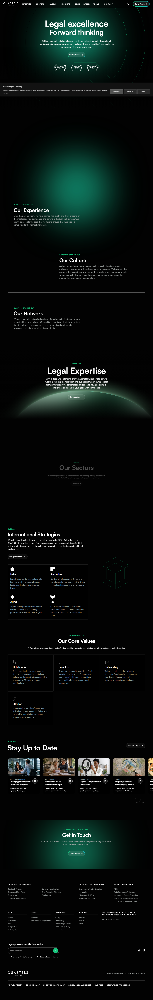



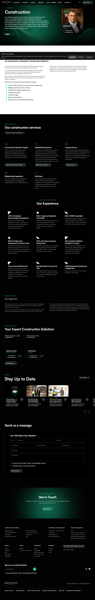

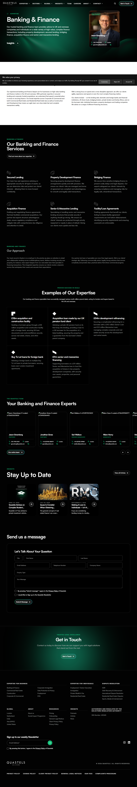

### Section Clips (screens/sections/)

*Clipped individual sections and components*

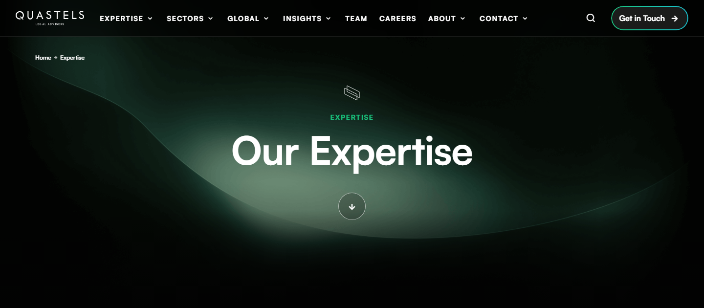

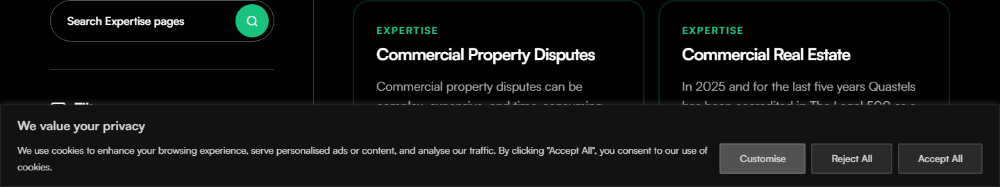


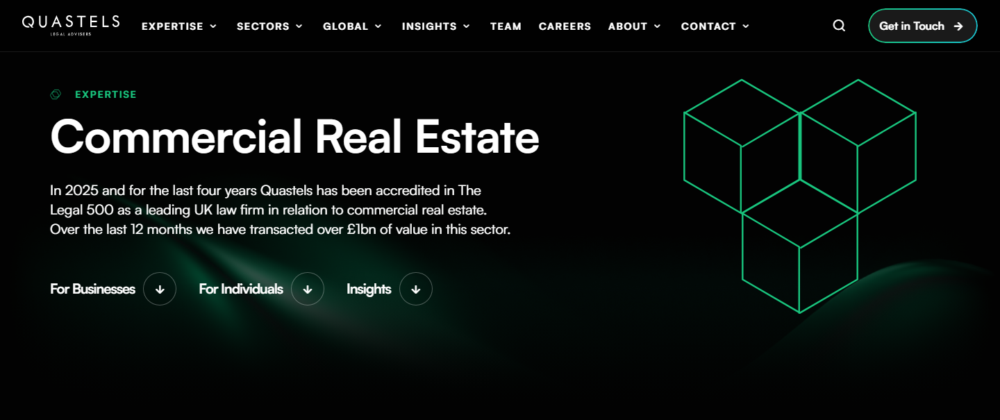

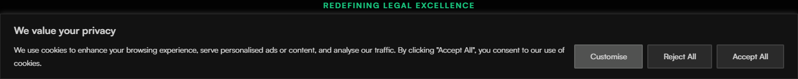

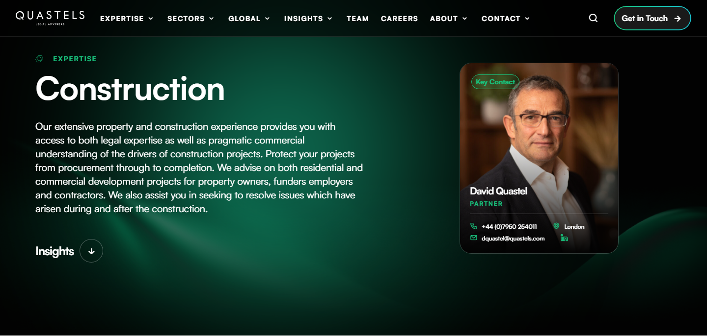

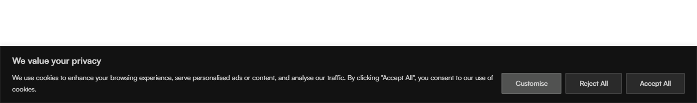

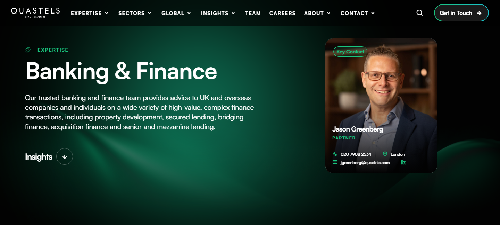

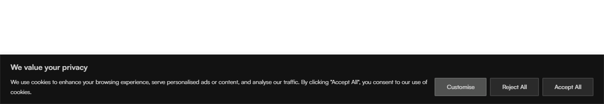

### Interaction States (screens/states/)

*Hover, focus, and active state captures*

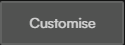


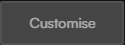


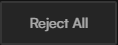


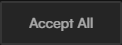


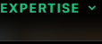


### Screenshot Index (screens/INDEX.md)

# Screenshot Index

## Scroll Journey

> Shows the cinematic state at each point of the page

| Scroll | Y Position | File |
|--------|-----------|------|
| 0% | 0px | `screens/scroll/scroll-000.png` |
| 17% | 1440px | `screens/scroll/scroll-017.png` |
| 33% | 2796px | `screens/scroll/scroll-033.png` |
| 50% | 4236px | `screens/scroll/scroll-050.png` |
| 67% | 5676px | `screens/scroll/scroll-067.png` |
| 83% | 7032px | `screens/scroll/scroll-083.png` |
| 100% | 8472px | `screens/scroll/scroll-100.png` |

## Pages

| Page | URL | File |
|------|-----|------|
| Quastels | London Law Firm | Premier Law Firms in Central London | `https://www.quastels.com/` | `screens/pages/home.png` |
| Expertise | Quastels | `https://www.quastels.com/expertise/` | `screens/pages/expertise.png` |
| Corporate Finance Lawyers London | Banking & Finance | `https://www.quastels.com/our-expertise/finance-banking/` | `screens/pages/our-expertise-finance-banking.png` |
| Commercial Real Estate Law Firm London | Quastels | `https://www.quastels.com/our-expertise/commercial-real-estate/` | `screens/pages/our-expertise-commercial-real-estate.png` |
| Construction Solicitors | Law Firm | Quastels | `https://www.quastels.com/our-expertise/construction/` | `screens/pages/our-expertise-construction.png` |

## Sections

| Page | Section | File |
|------|---------|------|
| home | #1 (section) | `screens/sections/home-section-1.png` |
| expertise | #1 (section) | `screens/sections/expertise-section-1.png` |
| expertise | #2 (section) | `screens/sections/expertise-section-2.png` |
| our-expertise-finance-banking | #1 (section) | `screens/sections/our-expertise-finance-banking-section-1.png` |
| our-expertise-finance-banking | #2 (section) | `screens/sections/our-expertise-finance-banking-section-2.png` |
| our-expertise-commercial-real-estate | #1 (section) | `screens/sections/our-expertise-commercial-real-estate-section-1.png` |
| our-expertise-commercial-real-estate | #2 (section) | `screens/sections/our-expertise-commercial-real-estate-section-2.png` |
| our-expertise-construction | #1 (section) | `screens/sections/our-expertise-construction-section-1.png` |
| our-expertise-construction | #2 (section) | `screens/sections/our-expertise-construction-section-2.png` |

## Homepage Screenshots (screenshots/)


